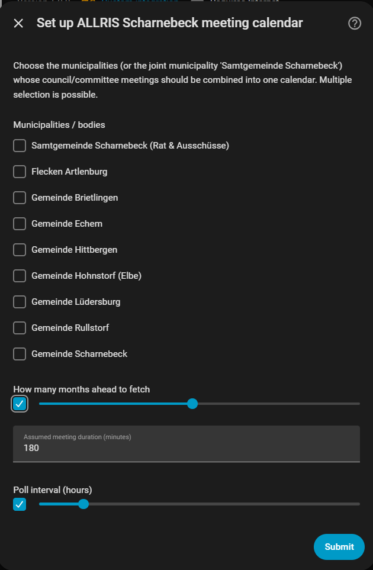

# ALLRIS Sitzungskalender Samtgemeinde Scharnebeck

Diese **inoffizielle** Home-Assistant-Integration liest den öffentlichen
Sitzungskalender der Samtgemeinde Scharnebeck aus dem ALLRIS-Ratsinformationssystem
(`https://www.scharnebeck.sitzung-online.de/public/si010`) und stellt die
Sitzungstermine als ganz normale Kalender-Entity in Home Assistant bereit —
inklusive automatischer, regelmäßiger Aktualisierung.

Du wählst bei der Einrichtung aus, welche Körperschaft(en) dich interessieren
(z. B. nur deine eigene Gemeinde, oder zusätzlich die Samtgemeinde-Sitzungen),
mit Mehrfachauswahl.

> **Hinweis / Disclaimer:** Dieses Projekt steht in keiner Verbindung zur
> Samtgemeinde Scharnebeck, zum Software-Hersteller von ALLRIS/CC e-gov GmbH
> oder zu sonstigen offiziellen Stellen. Es handelt sich um ein
> privates, community-getragenes Werkzeug, das die öffentlich einsehbare
> Kalenderseite automatisiert ausliest. Keine Gewähr für Richtigkeit oder
> Vollständigkeit der Termine — maßgeblich ist immer die offizielle
> ALLRIS-Website.

## Funktionsumfang

- Eine Kalender-Entity pro Konfigurationseintrag, die die Sitzungen aller
  ausgewählten Körperschaften zusammenfasst (z. B. "Samtgemeinde, Brietlingen,
  Echem" in einem gemeinsamen Kalender).
- Auswahl aus allen neun Körperschaften der Samtgemeinde Scharnebeck:
  Samtgemeinde Scharnebeck, Flecken Artlenburg, sowie den Gemeinden
  Brietlingen, Echem, Hittbergen, Hohnstorf (Elbe), Lüdersburg, Rullstorf und
  Scharnebeck.
- Mehrere Konfigurationseinträge mit unterschiedlichen Kombinationen möglich
  (z. B. ein Kalender nur für die eigene Gemeinde, ein zweiter mit allen
  Nachbargemeinden für den Gemeinderat).
- Einstellbar: wie viele Monate im Voraus abgefragt werden, angenommene
  Sitzungsdauer (die ALLRIS-Seite nennt nur die Startzeit) und das
  Abfrageintervall.
- Läuft direkt in Home Assistant (kein externes Skript, kein `shell_command`,
  keine ICS-Datei nötig) — Standardbibliothek von Python reicht aus.

## Voraussetzungen

- Home Assistant (getestet ab 2024.1, siehe `hacs.json`)
- [HACS](https://hacs.xyz/) installiert

## Installation über HACS (Custom Repository)

Diese Integration ist (noch) nicht im offiziellen HACS-Store gelistet und wird
daher als **Custom Repository** hinzugefügt:

1. In Home Assistant: **HACS** öffnen.
2. Oben rechts auf die drei Punkte (**⋮**) klicken → **Benutzerdefinierte
   Repositories** ("Custom repositories").
3. Repository-URL eintragen:
   `https://github.com/pmi1805/allris-sitzungskalender-sg-scharnebeck`
   Kategorie: **Integration**.
4. **Hinzufügen** klicken. Das Repository erscheint jetzt in der HACS-Liste.
5. In HACS nach **"ALLRIS Sitzungskalender SG Scharnebeck"** suchen und
   installieren.
6. Home Assistant neu starten (HACS fordert dazu auf).

*(Alternative ohne HACS: den Ordner
`custom_components/allris_scharnebeck` aus diesem Repository manuell nach
`/config/custom_components/allris_scharnebeck` auf deinem HA-Host kopieren
und Home Assistant neu starten.)*

## Einrichtung (Konfiguration)

1. **Einstellungen → Geräte & Dienste → Integration hinzufügen**.
2. Nach **"ALLRIS Sitzungskalender SG Scharnebeck"** suchen.
3. Im Einrichtungsdialog:
   - **Körperschaften**: eine oder mehrere der neun Körperschaften auswählen
     (Mehrfachauswahl per Klick/Checkbox). Beispiel: *Samtgemeinde
     Scharnebeck*, *Gemeinde Brietlingen*, *Gemeinde Echem*.
   - **Wie viele Monate im Voraus abfragen**: Standard 12.
   - **Angenommene Sitzungsdauer (Minuten)**: Standard 180 (3 Stunden) — die
     ALLRIS-Seite veröffentlicht nur die Startzeit, nicht das Ende.
   - **Abfrageintervall (Stunden)**: Standard 24 (1x täglich reicht für einen
     Sitzungskalender in aller Regel aus).
    

4. **Absenden** — es wird eine Kalender-Entity angelegt, z. B.
   `calendar.allris_sitzungen_samtgemeinde_brietlingen_echem`.

### Mehrere Kalender mit unterschiedlichen Kombinationen

Die Integration kann mehrfach hinzugefügt werden (Schritt 1–4 wiederholen) —
jede Kombination von Körperschaften erzeugt einen eigenen Konfigurationseintrag
mit eigener Kalender-Entity. Eine identische Kombination kann nicht doppelt
angelegt werden (Home Assistant meldet dann "bereits konfiguriert").

### Auswahl nachträglich ändern

Unter **Einstellungen → Geräte & Dienste** bei der Integration auf
**Konfigurieren** klicken, um die ausgewählten Körperschaften oder die
anderen Parameter jederzeit anzupassen. Die Kalender-Entity aktualisiert sich
danach automatisch (Neuladen der Integration).

## Verwendung im Dashboard

Die entstandene `calendar.*`-Entity kann wie jede andere Kalender-Entity in
Home Assistant verwendet werden, z. B. als **Kalenderkarte**
(`type: calendar`) in einem Dashboard, oder in Automationen (z. B. eine
Erinnerung X Stunden vor Sitzungsbeginn über den `calendar`-Trigger).

Beispiel für eine Dashboard-Karte:

```yaml
type: calendar
entities:
  - calendar.allris_sitzungen_samtgemeinde_brietlingen_echem
initial_view: listWeek
```

## Fehlersuche

- **Einstellungen → System → Protokolle**, nach `allris_scharnebeck` filtern.
- Debug-Logging aktivieren, z. B. in `configuration.yaml`:

  ```yaml
  logger:
    default: info
    logs:
      custom_components.allris_scharnebeck: debug
  ```

- Häufigste Fehlerursache ist eine vorübergehende Nichterreichbarkeit der
  ALLRIS-Seite oder eine Layoutänderung dort — die Integration meldet dies
  als "ALLRIS-Abfrage fehlgeschlagen" mit Details im Protokoll.

## Warum kein `shell_command` + ICS-Datei mehr?

Eine frühere, einfachere Variante dieses Projekts nutzte ein eigenständiges
Python-Skript per `shell_command`, das eine ICS-Datei schrieb, die wiederum
über die eingebaute `remote_calendar`-Integration eingelesen wurde. Diese
custom integration ersetzt das durch eine native Home-Assistant-Integration
mit Konfigurationsdialog, Mehrfachauswahl der Körperschaften und
automatischer Aktualisierung — ganz ohne manuell gepflegte
`configuration.yaml`-Einträge.

## Entwicklung / Tests

Die Kernlogik (Navigation, Parsing, Körperschafts-Zuordnung) liegt in
`custom_components/allris_scharnebeck/allris_client.py` und ist bewusst frei
von Home-Assistant-Importen gehalten, damit sie sich ohne installiertes
Home Assistant testen lässt:

```bash
python3 -m pytest tests/
```

## Lizenz

MIT, siehe [LICENSE](LICENSE).
